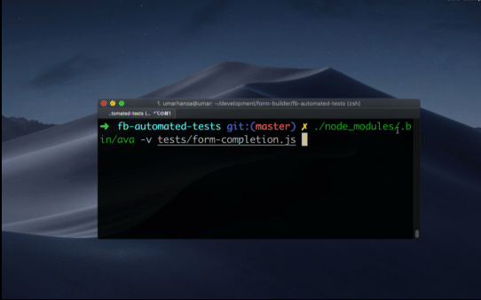
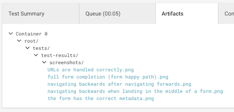

## Form Builder Automated Tests

[](https://circleci.com/gh/ministryofjustice/fb-automated-tests/tree/master)

### Introduction

This repository includes browser automation tests for a single form hosted on the Form Builder platform.

This test suite uses:

- [ava](https://github.com/avajs/ava) for assertions and the test runner
- [puppeteer](https://github.com/GoogleChrome/puppeteer) for browser automation (headless Chrome)



### Running locally

You'll need Node.js installed.

Run the following commands within this project:

```sh
npm install

# also dumps out screenshots & traces in the `test-results` folder
npm run test:ci

# without dumping screenshots and traces
npm test
```

#### Using a local instance of the form

By default, the tests will be run against the form in the `test-dev` environment

https://automated-testing.dev.integration.form.service.justice.gov.uk

but this can be overridden by setting

* FORM_URL (must end with trailing slash)

eg.

```sh
FORM_URL='http://localhost:3000/'
```

NB. unless the form instance you provide can handle the submission, you will probably want to disable email testing

#### Setting up environment variables for the email testing service

Rename `.env.sample` to `.env` and fill in the [mailosaur](https://mailosaur.com/) secrets accordingly. On CircleCI, these secrets have been entered as environment variables [through the app](https://circleci.com/gh/ministryofjustice/fb-automated-tests/edit#env-vars). This also appies to the Notify number and API key

* `EMAIL_SERVICE_API_KEY` is the API key which you can get from the dashboard
* `EMAIL_SERVICE_SERVER_ID` is the mailbox server ID which you can get from the dashboard
* `NOTIFY_API_KEY` is the API key for [Notify](https://www.notifications.service.gov.uk)
* `NOTIFY_PHONE_NUMBER` is the receiving phone number assigned to us by [Notify](https://www.notifications.service.gov.uk)

If these values are not provided, the tests will skip the email checking - it is also possible to disable the email checks explicitly by setting

* `SKIP_EMAIL`

#### Skipping save and return functionality

Save and return tests can be skipped by setting

* `SKIP_SAVE_RETURN`

If no values have been provided for the email testing setvices, the save and return tests will be skipped automatically.

### IMPORTANT: Mailosaur & Notify

Annoyingly, we are only on a trial Mailosaur plan which expires after a month. When you create a new account,
you must reset the `EMAIL_SERVICE_API_KEY` and `EMAIL_SERVICE_SERVER_ID`.

This also effects [Notify](https://www.notifications.service.gov.uk) as our testing account requires any
emails or phone numbers we wish to message to be whitelisted. When you create a new [mailosaur](https://mailosaur.com/)
account, you must whitelist the new email address otherwise Notify will not send emails to it.

You can see how email addresses are built in the [generateEmailAddress()](https://github.com/ministryofjustice/fb-automated-tests/blob/master/utils/email-service.js#L16) function.


### Writing a new test

Duplicate any existing test in the `tests` folder and modify it to your use case. Tests typically look like:

```js
test('Page has the correct URL', withPage, async (t, page) => {
  await page.goto('https://example.com/')
  const currentURL = await page.url()
  t.is(currentURL, 'https://example.com/')
})
```

View the [puppeteer](https://github.com/GoogleChrome/puppeteer) docs to learn how to control and drive a browser.

View the [ava](https://github.com/avajs/ava) docs to learn how to write assertions.

### JavaScript

Tests are written using modern JavaScript syntax, including [ES Modules](https://developer.mozilla.org/en-US/docs/Web/JavaScript/Reference/Statements/import) and [async](https://developer.mozilla.org/en-US/docs/Web/JavaScript/Reference/Statements/async_function) functions.

Most puppeteer methods return promises, so you must remember to `await` them.

### Linting

We use ESLint to lint our JavaScript code.

To run linting (without running the automation tests), use:

```sh
npm run lint
```

To ensure tests are kept simple, easy to read and easy to debug, we extend our `.eslintrc` with a few rules such as:

* [Cyclomatic Complexity](https://eslint.org/docs/rules/complexity)
* [max-depth](https://eslint.org/docs/rules/max-depth)
* [ava recommended rules](https://github.com/avajs/eslint-plugin-ava)

Most rules however are defined in [eslint-config-fb](https://github.com/ministryofjustice/eslint-config-fb).

### CircleCI

These browser automation tests are currently run on a cron schedule in [CircleCI](https://circleci.com/gh/ministryofjustice/fb-automated-tests).

If linting or testing fails, clear error messages are provided through the CircleCI interface so you can understand what went wrong.

#### Screenshots

Screenshots of the end-states of webpages are uploaded as artifacts to CircleCI.

For example, if a web page completely fails to load, viewing the screenshot of the failing test will confirm this to you immediately.



To view a screenshot:

1. Navigate to the Artifacts tab of your build on CircleCI
2. Click the screenshot, where the file name matches the test name

#### Traces

[HAR](https://en.wikipedia.org/wiki/.har) files and Chrome traces are also stored in the `har` and `traces` folder respectively.

#### Parallelism

Tests are currently designed to run in parallel, both on your local development environment, and on CircleCI. This drastically reduces build times.

### Reliability of tests

Browser based automation tests can be notoriously unreliable/flaky. Here are some tips:

* Do __not__ use `sleep`'s. Use the appropriate puppeteer methods, like `page.waitFor`
* Use meaningful assertion messages - this ensures failed assertions communicate why they are failing effectively
* When adding more complicated tests, or a big batch of tests, run them locally, at least a few times
* Ensure test isolation. Tests are already set up to be completely isolated from one another. However be aware that forms are sesssion (cookie) based, and therefore stateful by default. Where possible, ensure tests do not rely on state.

#### Testing locally

You can run tests repeatedly in quick succession in your local development environment to verify that they consistently pass:

```sh
while sleep 30 ; do ./node_modules/.bin/ava ; done
```

It is much easier to discover flaky tests locally, rather than in a CI environment.
