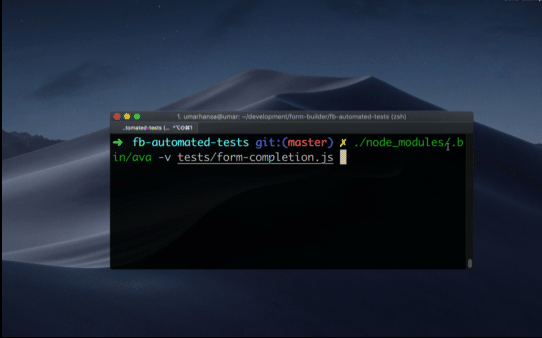
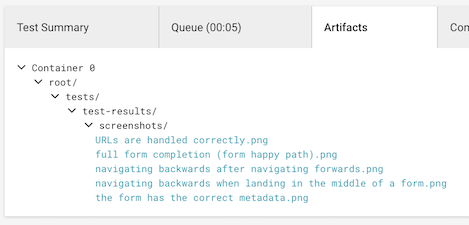

## Form builder automated tests

[](https://circleci.com/gh/ministryofjustice/fb-automated-tests/tree/master)

### Introduction

This repository includes browser automation tests for a form hosted on the Form Builder platform. The test suite uses [ava](https://github.com/avajs/ava) and browser automation is managed with [puppeteer](https://github.com/GoogleChrome/puppeteer)



### CircleCI

These browser automation tests are currently run on a schedule in [CircleCI](https://circleci.com/gh/ministryofjustice/fb-automated-tests). If linting or testing fails, clear error messages are provided through the CircleCI interface so you can understand what went wrong.

#### Screenshots

Screenshots of the end-states of webpages are uploaded as artifacts to CircleCI. If, for example, a web page completely fails to load, viewing the screenshot for the failing test will confirm this to you immediately.



To view a screenshot:

1. Navigate to the Artifacts tab of your build on CircleCI
2. Click the screenshot, where the file name matches the test name

### Linting

We use ESLint to lint our JavaScript code. Use `npm run lint` to lint your code.

### Writing a new test

Duplicate any existing test and modify it to your use case. Tests typically look like:

```js
test('Page has the correct URL', withPage, async (t, page) => {
  await page.goto('https://example.com/')
  const currentURL = await page.url()
  t.is(currentURL, 'https://example.com/')
})
```

View the [puppeteer](https://github.com/GoogleChrome/puppeteer) docs to learn how to control and drive a browser.

View the [ava](https://github.com/avajs/ava) docs to learn how to write assertions.

### Reliability of tests

Browser based automation tests can be notoriously unreliable/flaky. You can run them repeatedly in quick succession in your local development environment, to verify they consistently pass:

```sh
while sleep 30 ; do ./node_modules/.bin/ava ; done
```

It is much easier to find discover flaky tests locally, rather than in a CI environment.